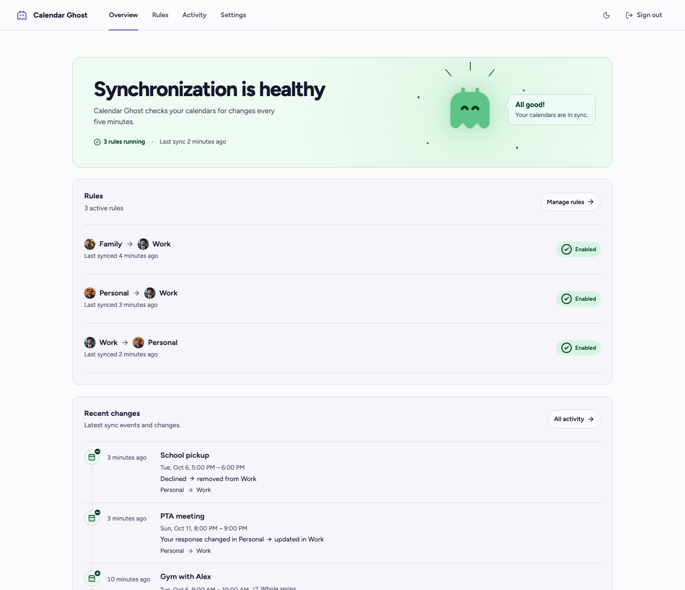
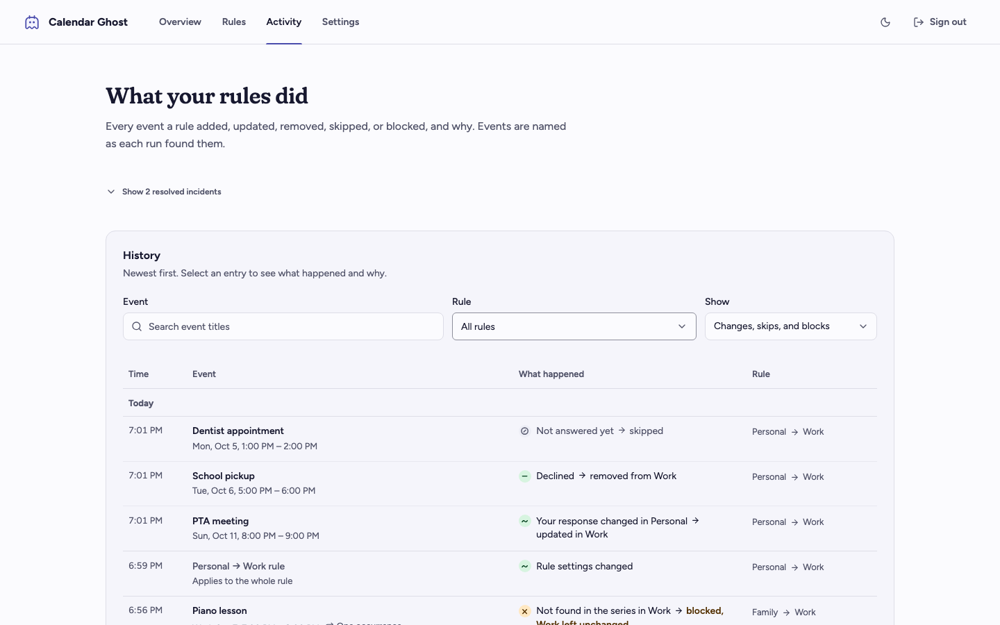
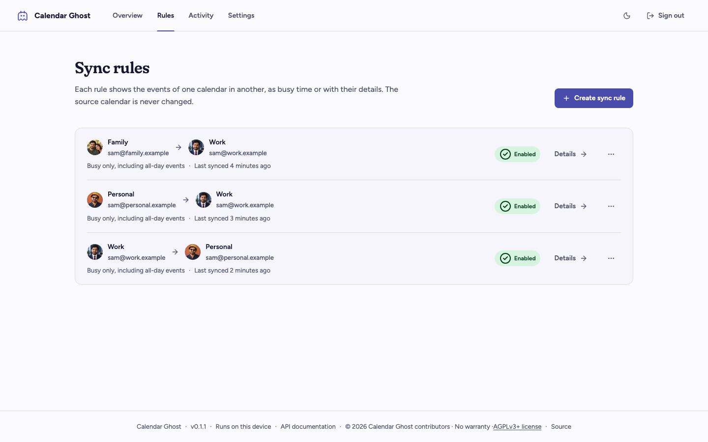
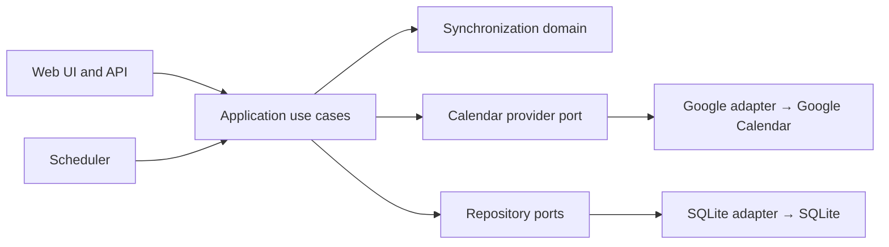

# Calendar Ghost

*Your busy time, everywhere it needs to be.* Self-hosted, single-installation, one-way sync between Google calendars.

A self-hosted, source-authoritative Google Calendar synchronizer. Define a directional rule from
one calendar to another, including calendars owned by different Google identities, and keep a
privacy-controlled projection synchronized without copying invitations or depending on a hosted
coordinator.

> [!WARNING]
> **Pre-alpha:** the architecture, synchronization engine, authenticated API, Google adapter, and
> Web UI form a working first vertical slice, but the project has not completed live-account
> endurance testing or a production-readiness review. Use test calendars and keep backups. Do not
> connect important calendars yet.

<p align="center">
  
</p>

## Editions and license

This repository contains the Calendar Ghost Community Edition. It is a single-installation,
single-administrator deployment designed for self-hosting on a personal server, home lab, or small
machine. It uses one SQLite database and does not require a Calendar Ghost account or hosted
coordinator. There is no Community Edition subscription or license server; the operator provides
the infrastructure and remains responsible for any hosting or provider costs.

The Community Edition is genuine open-source software under the [GNU Affero General Public License,
version 3 or later](LICENSE). AGPL permits commercial use, including a competing service, when its
conditions are met. Calendar Ghost's official name and marks are separate from the software license;
see [TRADEMARKS.md](TRADEMARKS.md). A future Calendar Ghost hosted service will run this same open
code for people who do not want to operate it, with no closed components. It will charge for running
Calendar Ghost for you, not for features: the Community Edition will not have features removed,
limited, or held back to push people toward it.

Read [Licensing and editions](docs/licensing.md) and [Data ownership and privacy](docs/data-ownership.md)
before deploying it with real calendars.

## See it in action

These screenshots use synthetic data and local generated avatar portraits from the development
preview, and follow your GitHub light or dark appearance. They contain no personal Google Calendar
content and show the main self-hosted workflow: see rule health, inspect Activity, and manage
directional rules. The preview follows one fictional person, Sam, across three context-specific
Google identities: `sam@personal.example`, `sam@family.example`, and `sam@work.example`. The
portraits keep him recognizable while the accessories and companion make each part of his life
distinct.

<p align="center">
<picture>
  <source media="(prefers-color-scheme: dark)" srcset="docs/assets/calendar-ghost-overview-dark.png">
  
</picture>
</p>
<p align="center"><em>Overview: synchronization health, rules, and recent changes marked + added, − removed, ~ changed.</em></p>

<table>
  <tr>
    <td width="50%"><picture>
      <source media="(prefers-color-scheme: dark)" srcset="docs/assets/calendar-ghost-activity-dark.png">
      
    </picture></td>
    <td width="50%"><picture>
      <source media="(prefers-color-scheme: dark)" srcset="docs/assets/calendar-ghost-rules-dark.png">
      
    </picture></td>
  </tr>
  <tr>
    <td align="center"><em>Activity explains what each rule did.</em></td>
    <td align="center"><em>Rules make source and destination ownership visible.</em></td>
  </tr>
</table>

## Why this project exists

Sharing availability between personal and work calendars often means granting broad access,
duplicating invitations, or trusting another hosted service. Calendar Ghost runs on your own
machine and creates only the destination representation selected by each rule.

- **Directional by design:** one rule observes exactly one source calendar and manages exactly one
  destination calendar.
- **Source authoritative:** destination edits, missing projections, and source cancellations are
  repaired during synchronization; reconciliation reports anything still different.
- **Privacy first:** new rules default to a `Busy` projection. Detail-copying remains opt-in and
  never copies attendees, organizer identity, conferencing data, attachments, or invitations.
- **Cross-account:** source and destination calendars may belong to different Google identities.
- **Safe activation:** every rule must pass a side-effect-free preview before it can be enabled.
- **Self-contained:** SQLite, scheduling, the API, and the Web UI run as one lightweight service.
- **No telemetry:** a functional installation communicates only with the Google APIs needed for
  calendar synchronization and any notification endpoint you explicitly configure.

## Current capabilities

| Area | Behavior |
| --- | --- |
| Events | Timed events, all-day events, recurring series, single-occurrence changes, and cancellations |
| Policies | Busy-only or detail-copy projection; include or exclude all-day events; mark, sync, or skip events answered Maybe; sync unanswered invitations as Maybe or wait for an answer, per rule. Declined events are never synced |
| Scheduling | Source and destination incremental polling every five minutes plus **Sync Now** |
| Reconciliation | Daily full pass plus **Reconcile Now**, which reports remaining drift and records conflicts as blocked |
| Loop prevention | Private managed-origin metadata prevents projections from becoming sources |
| Reliability | Stable operation keys, cursor-last persistence, retry backoff, and isolated rule failures |
| Incidents | Authenticated Activity view, deduplication, optional SMTP, and optional webhook delivery |
| Monitoring | Installation Status for monitors, homelab dashboards, and AI agents through `GET /api/v1/status` and an MCP server at `/mcp`, authorized with Integration Tokens issued in Settings |
| Access | One local administrator password and encrypted Google OAuth credentials |
| Storage | Database and log usage in Settings, administrator-chosen Activity retention, and log download or purge |
| Appearance | Device-aware light and dark themes with a browser-local override |
| Deployment | One Docker image and Compose service for `linux/amd64` and `linux/arm64` |

Google Calendar is the only provider in the initial release. Outlook and CalDAV are architectural
possibilities, not currently supported features.

## Quick start with Docker

For the complete Google Cloud, OAuth, LAN/HTTPS, backup, and recovery checklist, see the
[self-hosting guide](docs/self-hosting.md).

### Prerequisites

- Docker with Compose
- A Google Cloud project
- One or more Google accounts with Google Calendar enabled

### 1. Configure Google

In Google Cloud:

1. Enable the **Google Calendar API**.
2. Configure the Google Auth Platform consent screen. For an external app in testing, add every
   Google identity you intend to connect as a test user.
3. Create an **OAuth 2.0 Client ID** with application type **Web application**.
4. Add this exact authorized redirect URI:

   ```text
   http://localhost:8000/api/v1/oauth/google/callback
   ```

Google compares OAuth redirect URIs exactly, including scheme, host, port, path, and trailing
slash. See Google's guides for [enabling Workspace APIs](https://developers.google.com/workspace/guides/enable-apis),
[web-server OAuth](https://developers.google.com/identity/protocols/oauth2/web-server), and
[Calendar scopes](https://developers.google.com/workspace/calendar/api/auth).

Running on a Raspberry Pi or another LAN host? Google rejects plain-HTTP redirect URIs other than
`localhost`, so read [Google OAuth redirect URI on a LAN host](docs/deployment.md#google-oauth-redirect-uri-on-a-lan-host)
before registering the redirect URI.

The app requests event access and read-only calendar-list access for synchronization, plus basic
profile access (`openid`, `userinfo.profile`) so each Connected Account shows its Google name and
photo. Profile access is optional; without it, accounts show initials.

### 2. Configure local secrets

Copy the example file:

```sh
cp .env.example .env
```

Generate a 256-bit installation master key:

```sh
python3 -c 'import base64,secrets; print(base64.urlsafe_b64encode(secrets.token_bytes(32)).decode())'
```

Then set these values in `.env`:

```dotenv
CALENDAR_SYNC_MASTER_KEY=PASTE_GENERATED_KEY_HERE
CALENDAR_SYNC_GOOGLE_CLIENT_ID=PASTE_GOOGLE_CLIENT_ID_HERE
CALENDAR_SYNC_GOOGLE_CLIENT_SECRET=PASTE_GOOGLE_CLIENT_SECRET_HERE
CALENDAR_SYNC_GOOGLE_REDIRECT_URI=http://localhost:8000/api/v1/oauth/google/callback
```

The master key encrypts stored Google credentials. It is not sent to Google. Back it up separately
from the database and never change it for an existing installation: losing it makes connected
account credentials unreadable.

### 3. Start the service

```sh
docker compose up -d --build
```

Open <http://localhost:8000>, create the local administrator, and follow the three-step setup:

1. Connect each Google identity you need.
2. Create a directional rule and choose its privacy, all-day, Maybe, and unanswered-invitation policies.
3. Preview the rule, inspect the result, and enable it.

The **Overview** leads with one plain-language health state and at most one next action:

| State | When | What to do |
| --- | --- | --- |
| Stopped | A rule is suspended, such as when a Google account's authorization expired | Reauthorize the account or review the rule |
| Needs a look | Rules keep running, but events were blocked or a problem kept happening | See the blocked events or the rule |
| Waiting for Google | Google is limiting or failing requests; the rule retries by itself | Wait; check Google's status if it lasts more than a day |
| Paused | Every rule that synced before is paused | Start a rule again when you want |
| Setup | Nothing is synchronizing yet | Follow the three Getting started steps |
| Healthy | Every running rule is up to date | Nothing |

When several problems are open at once, the most urgent leads and the rest are listed under it.
Below the health state, the Overview lists the rules and the latest changes, each marked with what
it did to the destination calendar: **+** added (including an event put back), **−** removed,
**~** changed, or **×** blocked.

**Activity** is a table of what each rule did, grouped by day: the time, the event and when it
happens, what happened as what Calendar Ghost observed and what it did about it (such as
"Cancelled in Personal → removed from Work" or "Missing from Work → put back again"), and the rule.
Each outcome carries the same sign as on the Overview, with ✓ for an event already up to date and
⊘ for one skipped. Recurring events say whether the entry was about the whole series or one occurrence. A blocked
entry says what is now different in the destination calendar and whether anything needs doing. Each entry records its event's title and time when the run makes the decision,
so Activity names events without asking Google and shows when an event was renamed. By default Activity lists changes, skips, and blocks; **All decisions** and **No change needed** also list
the checks that found an event already up to date. Choose a rule from the picker, which shows each
rule's calendars and accounts, or select a row's rule to filter to it. Select an entry to open its
details beside the table: the event, what happened and why, the copy in the destination calendar,
and technical identifiers on demand. The rule, filter, and open entry are kept in the address, so
the view survives reloads and can be linked.

The main sections have stable URLs at `/overview`, `/rules`, `/activity`, and `/settings`, so they
can be bookmarked and browser back/forward navigation works as expected.

Open **View details** on a rule (`/rules/{id}`) to see its calendars, policy, projection count, and
latest runs. Changing any of its policies pauses the rule until it passes a new preview,
then rewrites existing projections on the next run. Changing a calendar removes the rule and creates
a new draft; removing a rule asks whether to delete its projections (recommended) or keep them as
ordinary events that are no longer managed. Removal never deletes an event whose ownership it cannot
verify; such events are left in place and listed under **Blocked** in Activity.

Use **Settings → Connected accounts** to review every authorized identity, connect another Google
account, check its Calendar API access, or disconnect it. **Check access** verifies calendar-list
and event permissions with read-only requests and reports how many visible calendars can be used as
destinations. Disconnecting removes stored Google credentials and degrades any enabled rule that
uses the identity; mappings, Managed Projections, and incremental positions are preserved for safe
reauthorization. A disconnected account says how many of its rules stopped and offers
**Reauthorize account**, which is disabled until Google OAuth is configured. Accounts connected before profile photos were supported show initials until they
are connected again with **Connect Google account**, which updates the existing identity in place.

Use **Settings → Storage** to see the database size, the number of Activity entries, the oldest
one, and any space earlier clearing left to reclaim, and clear Activity older than 30, 90, 180, or
365 days; an inline confirmation shows how many entries that removes before you confirm, and offers
**Reclaim space** when nothing is old enough but space is still left. The Logs row shows the size and date range of the
service's own rotating log files and offers **Download** and **Purge logs**, so an administrator
can retrieve or clear them without SSH access to the host.

Check service health with:

```sh
curl --fail http://localhost:8000/health
```

Stop the installation without deleting its named data volume:

```sh
docker compose down
```

### 4. Connect monitors and AI agents (optional)

Uptime Kuma, homelab dashboards such as Homepage, and AI agents such as Claude Code or Codex can
read whether synchronization is healthy. Open **Settings → Integrations**, choose **Show**, name a
token for the tool that will use it, and choose **Issue token**. Copy the token: it is shown once.
A token only reads status; it can never change a rule or a calendar, and you can revoke it at any
time.

Read the status with any HTTP client:

```sh
curl -H "Authorization: Bearer $CALENDAR_GHOST_TOKEN" http://localhost:8000/api/v1/status
```

The answer names one overall `status` (`healthy`, `waiting`, `review`, `stopped`, `stalled`,
`paused`, or `setup`), a `needs_attention` flag for alerting, each current problem, and every rule.
AI agents use the MCP server at `/mcp` instead, for example:

```sh
claude mcp add --transport http calendar-ghost http://localhost:8000/mcp \
  --header "Authorization: Bearer ${CALENDAR_GHOST_TOKEN}"
```

Then ask the agent "Is my calendar sync healthy?". Codex and apps such as Claude Desktop connect too;
Settings shows ready-made examples for each tool, filled in with this installation's address. The
[self-hosting guide](docs/self-hosting.md#6-connect-monitors-and-agents) explains every field, each
status, and setup for Uptime Kuma, Homepage, Claude Code, Codex, and Claude Desktop.

## How synchronization works

The first run reads source events ending no earlier than 30 days before the run, with no future
cutoff, observes the destination calendar, and records Google's opaque incremental tokens for both
endpoints. Later runs consume both change feeds, so a destination-only edit or deletion is repaired
on the next sync without repeatedly scanning every event. Google's change feed also reports edits to
events of any age; an unsynced single event that ended more than 30 days ago is skipped, while an
already-synced event keeps being updated.

For every relevant source event, the domain chooses one action:

- **Create** a projection when none is mapped or the managed destination is missing.
- **Update** when source data or destination drift differs from the expected projection.
- **Delete** only when a mapping proves ownership and the source was cancelled or excluded.
- **Ignore** content that is current, excluded, or itself a managed projection.
- **Conflict** when identity or ownership is ambiguous; the system does not guess.

The cursor advances only after every change in the batch succeeds. Provider writes carry stable
operation keys so a retry after partial failure recovers the same logical projection instead of
creating a duplicate. See [the synchronization model](docs/sync-model.md) for the complete behavior.

## Privacy and security model

- Audit entries store each source event's title and time in plain text, so Activity can name
  events ([ADR 0014](docs/adr/0014-record-event-titles-on-audit-entries.md)). To say what changed
  in an event, SQLite also keeps its latest description, location, guest addresses, recurrence,
  and conferencing links, and 90 days of their earlier values, sealed with a key derived from the
  installation master key ([ADR 0017](docs/adr/0017-record-source-changes.md)). Values are stored
  as Google returns them, including any meeting codes in descriptions. Treat the database and its
  backups as sensitive; together with the master key they reveal those details.
- Activity is kept until the administrator clears it. Settings → Storage shows the database size
  and Activity's entry count and oldest entry, and clears entries older than 30, 90, 180, or 365
  days, keeping, per rule and source event, the older entries newer ones are compared with
  (normally the latest entry older than the cutoff and the latest that recorded a title)
  ([ADR 0019](docs/adr/0019-administrator-chosen-activity-retention.md)).
- Mappings retain provider IDs, revisions, and a non-reversible projection fingerprint.
- Google access and refresh credentials are encrypted at rest with AES-256-GCM using the separate
  installation master key.
- Disconnecting an account discards its stored Google credentials without deleting rules,
  mappings, or Managed Projections.
- The OAuth flow requests event access and read-only calendar-list discovery; it does not request
  general Google account access.
- The account access check requests calendar metadata and, from one calendar, event IDs only. It
  does not retain event data or make provider writes.
- Google writes use `sendUpdates=none`, and projections contain no attendees or invitation data.
- The Web UI and operational API require the local administrator session. `/health` remains public
  and intentionally minimal.
- Integration Tokens read Installation Status only, through `GET /api/v1/status` and `/mcp`; every
  other route refuses them. Only a SHA-256 hash of each token is stored, the token is shown once,
  and it can be revoked at any time. Status names rules by their calendars and never contains event
  content, calendar IDs, or account emails ([ADR 0023](docs/adr/0023-integration-tokens-installation-status-and-mcp.md)).
- There is no mandatory analytics, license server, remote logging, or developer-operated backend.

For deployment hardening, backup expectations, and HTTPS guidance, read
[docs/deployment.md](docs/deployment.md) and the [data ownership guide](docs/data-ownership.md).
Report vulnerabilities privately as described in [SECURITY.md](SECURITY.md).

## Configuration reference

Docker Compose reads `.env` from the repository root. Real secrets must never be committed.

| Variable | Required | Purpose |
| --- | --- | --- |
| `CALENDAR_SYNC_DATABASE_PATH` | No | SQLite path; defaults locally to `./calendar-sync.db`, while Compose uses `/data/calendar-sync.db` |
| `CALENDAR_SYNC_MASTER_KEY` | For Google | URL-safe Base64 value decoding to exactly 32 bytes |
| `CALENDAR_SYNC_GOOGLE_CLIENT_ID` | For Google | OAuth Web application client ID |
| `CALENDAR_SYNC_GOOGLE_CLIENT_SECRET` | For Google | OAuth Web application client secret |
| `CALENDAR_SYNC_GOOGLE_REDIRECT_URI` | For Google | Exact registered OAuth callback |
| `CALENDAR_SYNC_SECURE_COOKIES` | No | Set `true` when serving the app over HTTPS |
| `CALENDAR_SYNC_LOG_LEVEL` | No | Application log level (`DEBUG`, `INFO`, `WARNING`, `ERROR`); defaults to `INFO` |
| `CALENDAR_SYNC_LOG_DIR` | No | Directory for rotating log files; unset defaults to `logs` beside the database (`/data/logs` in Compose). Empty turns file logging off |
| `CALENDAR_SYNC_INCIDENT_WEBHOOK_URL` | No | Receives a JSON POST when a deduplicated incident opens |
| `CALENDAR_SYNC_SMTP_HOST` | No | SMTP server for incident email |
| `CALENDAR_SYNC_SMTP_PORT` | No | SMTP port; defaults to `587` |
| `CALENDAR_SYNC_SMTP_USERNAME` | No | Optional SMTP authentication username |
| `CALENDAR_SYNC_SMTP_PASSWORD` | No | Optional SMTP authentication password |
| `CALENDAR_SYNC_SMTP_SENDER` | With SMTP | Incident email sender |
| `CALENDAR_SYNC_SMTP_RECIPIENT` | With SMTP | Incident email recipient |
| `CALENDAR_SYNC_SMTP_STARTTLS` | No | Enable SMTP STARTTLS; defaults to `true` |

Notification delivery is best-effort. A delivery failure never prevents the incident from being
recorded locally or stops later synchronization attempts.

## Architecture

The project is a modular monolith with ports-and-adapters boundaries. The synchronization domain
contains no FastAPI, SQLite, Google SDK, React, OAuth, or Docker dependencies.



Runtime frameworks and providers are replaceable edges around the product's core decisions. Read
[docs/architecture.md](docs/architecture.md), [docs/domain-model.md](docs/domain-model.md), and the
[architecture decision records](docs/adr/) before making structural changes. Canonical domain
language and settled product decisions live in [CONTEXT.md](CONTEXT.md).

## Local development

Backend requirements: Python 3.12. Frontend requirements: Node.js 22 or later.

```sh
python3.12 -m venv .venv
.venv/bin/pip install -e '.[dev]'
npm ci --prefix web
```

Run FastAPI on port 8000:

```sh
.venv/bin/uvicorn calendar_sync.interfaces.api.app:create_app --factory --reload
```

In another terminal, run Vite on port 5173:

```sh
npm --prefix web run dev
```

Vite proxies `/api` and `/health` to FastAPI. The OpenAPI interface is available at
<http://localhost:8000/api/docs>.

### Quality checks

```sh
.venv/bin/ruff format --check .
.venv/bin/ruff check .
.venv/bin/mypy
.venv/bin/lint-imports
.venv/bin/pytest --cov --cov-report=term-missing --cov-fail-under=80
npm --prefix web run typecheck
npm --prefix web run lint
npm --prefix web run test
npm --prefix web run build
docker compose build
```

The normal test suite uses synthetic fixtures and fake providers; it never requires a personal
Google account. CI runs formatting, linting, strict type checking, tests, frontend compilation, and
multi-platform Docker builds.

See [docs/development.md](docs/development.md) for architecture rules and
[CONTRIBUTING.md](CONTRIBUTING.md) for the contribution workflow.

## Repository map

```text
AGENTS.md          Canonical project instructions for coding agents
src/calendar_sync/
  domain/          Provider-independent entities, value objects, policies, and decisions
  application/     Use cases and boundary protocols
  infrastructure/  Google, SQLite, security, scheduling, and notification adapters
  interfaces/      FastAPI routes, the MCP server, and the compiled Web UI
  bootstrap/       Explicit dependency composition
web/               React, TypeScript, Vite, Tailwind CSS, and shadcn-style component source
tests/             Domain, application, adapter, and public-boundary tests
docs/              Architecture, operation guides, domain references, and ADRs
```

## Project status and support

This repository currently targets `0.1.1` and follows semantic versioning. Persistent configuration
and SQLite migrations are treated as compatibility surfaces, but pre-alpha releases may still
change behavior before the first stable release.

- For setup and operational failures, start with [docs/troubleshooting.md](docs/troubleshooting.md).
- For proposed changes, open a focused issue describing the observable problem and expected
  behavior.
- For exploitable security issues, do **not** file a public issue; follow
  [SECURITY.md](SECURITY.md).

## Contributing

Contributions are welcome. Please read [CONTRIBUTING.md](CONTRIBUTING.md) and
[CODE_OF_CONDUCT.md](CODE_OF_CONDUCT.md) before opening a pull request. Changes to synchronization
behavior should include domain tests; hard-to-reverse architectural choices should include an ADR.

## License

Calendar Ghost Community Edition is available under the [GNU Affero General Public License, version 3
or later](LICENSE). This is an OSI-approved open-source license designed to keep source available
when modified software is offered over a network. See [Licensing and editions](docs/licensing.md) for
the relationship between the Community Edition and the future hosted service.

Copyright (C) 2026 Calendar Ghost contributors.

The Web UI bundles the Fraunces and Figtree typefaces, which are licensed under the SIL Open Font
License 1.1. Their notices are in [`web/public/licenses/`](web/public/licenses/) and ship with the
built interface at `/licenses/`.
